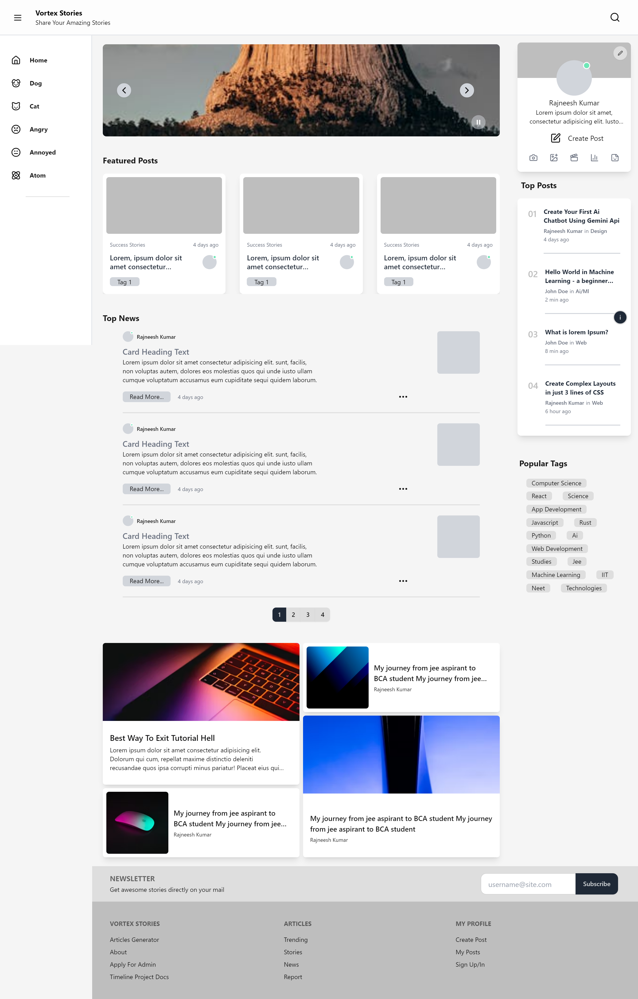
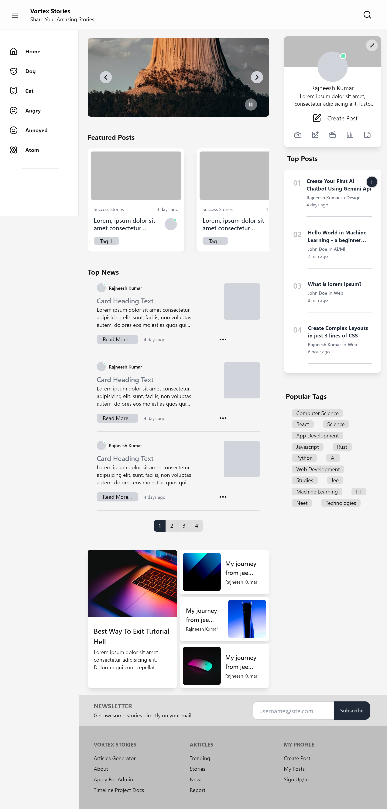
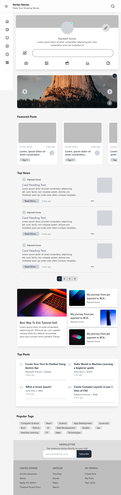
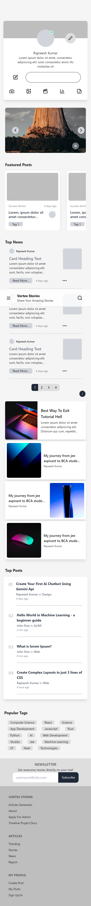

# Vortex Stories V4 
**Blog News Articles Platform React Frontend**

## Index
- [Introduction](#introduction)
- [Live View](#live-view)
- [Tech Stack](#tech-stack-vortex-stories-v4)
- [Features Plan](#features-planned)
- [Images](#images)
- [Install](#install)
- [Contact](#contact)


## Introduction
Vortex Stories is a platform for sharing thoughts and stories, reading articles, and viewing news. This project, initially developed using HTML, CSS, and JavaScript for the frontend and a backend template with Bootstrap, PHP, and MySQL.

---
Now, Vortex Stories is being rebuilt using modern technologies to enhance functionality and performance.

The new version will use React and TailwindCSS for the frontend, and Node.js, Express, and MongoDB ( learning backend 2024 ) for the backend.

This repository focuses on the frontend development to showcase my skills in frontend development.

## Live View
- [Visit New Vortex Stories](https://vortex-stories.netlify.app/) 

- [View Old Project](http://vortexstories.lovestoblog.com/?i=1)

  - Use **site password** -  `mohit` `mohit@1234`

  - Use **SubAdmin password** - `test` `test@1234`

``` 
!!! NOTE For Old Vortex Stories !!!: 
- Frontend was created in Mobile (Acode editor), So for better experience see in tab or mobile screen size.

- Not Completed: some parts of site may not work or without style. this is because i was busy in college exams '1st year sem 2' 

- Hosted on a free hosting site (infinityfree), so it can be deleted in future
```


## Tech Stack Vortex Stories V4
- **Frontend** : Reactjs (Vite), TailwindCss, DaisyUI
- **Backend** : {soon}


## Features (Planned)
- Ai Based Articles Generator, Article Enhancer
- Read News/Blogs/Articles (obviously)
- User Login, Online/offline
- Dashboard for Article Writing/backend

## Images
Always see live View [Visit Vortex Stories](https://vortex-stories.netlify.app/)


- Project Plan Layout (Paint)
 

 - Rough Design Plan 2
 

- Current Project ScreenShot (XL Big Screens)
 

- Current Project ScreenShot (Lg Pc Screens)
 

- Current Project ScreenShot (Md Tab Screens)
 

- Current Project ScreenShot (Sm Mobile Screens)
 


## Install 

```
https://github.com/Rajneeshzytox/VortexStories.git
```

1. **Clone the repository**

``` shsssss
gh repo clone Rajneeshzytox/VortexStories
cd VortexStories
```

2. **Install dependencies**

```sh
npm i
<!-- or -->
npm install
```

3. **Run**

```sh
npm run dev
```

Open:   http://localhost:5173/

contact if any issue...


## Contact
- **Email**: kumarrajneesh.work@gmail.com
- **LinkedIn**: [rajneeshzytox](https://www.linkedin.com/in/rajneeshzytox/)
- **Instagram**: [rajneeshzytox](https://instagram.com/rajneeshzytox)
- **Twitter (X)**: [rajneeshzytox](https://x.com/rajneeshzytox)
- **Portfolio**: [rajneeshzytox](rajneeshzytox.github.io/portfolio) ( ! nothing to see on portfolio, working on projects ! )